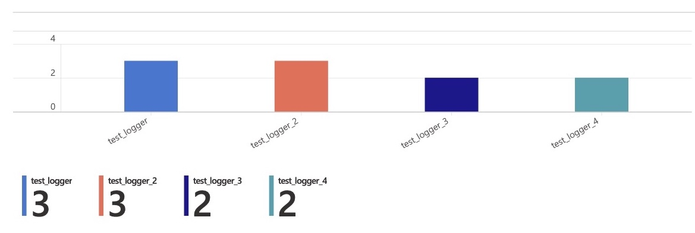
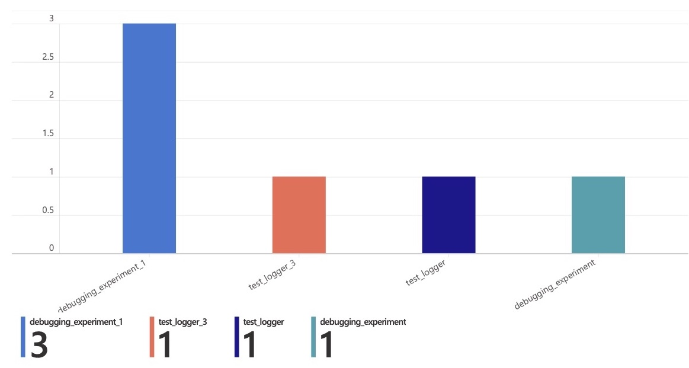
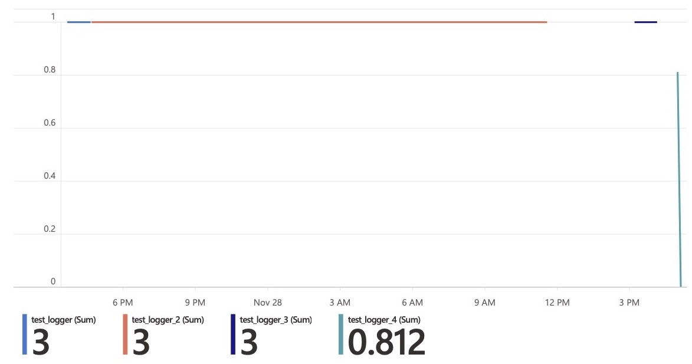

# Examples of Azure Log Analytics queries

## Experiments with successful Runs that logged errors

```sql
AppTraces
| where Properties.level == "ERROR"
| extend ExperimentName=tostring(Properties.experiment_name), CorrelationId=tostring(Properties.correlation_id)
| join (AmlRunStatusChangedEvent 
        | where Status == "Completed"
        | project RunId, RunStatus=Status, WorkspaceName) on $left.CorrelationId==$right.RunId
| summarize Count=count() by ExperimentName, RunId
| render barchart
```



## Failed Runs per Experiment

```sql
AmlComputeJobEvent
| where OperationName == "JobFailed"
| summarize Count=count() by ExperimentName, JobName
| render barchart
```



## Accuracy by Experiment over time

```sql
AppMetrics
| where Name == "accuracy" 
| extend RunId=tostring(Properties.correlation_id)
| project TimeGenerated, RunId, Name, Val=Sum/ItemCount
| join AmlComputeJobEvent on $left.RunId == $right.JobName
| project TimeGenerated, ExperimentName, Name, Val
| distinct TimeGenerated, ExperimentName, Name, Val
| order by TimeGenerated asc
| render timechart
```



## Workbook ARM file

`log_analytics_workbook_sample_arm.json` contains ARM template of Azure ML Workbook that runs the queries above.

```bash
az deployment group create \
  --name AMLObservabilityExamplesDeployment \
  --resource-group <Resource Group to deploy to> \
  --template-file log_analytics_workbook_sample_arm.json \
  --parameters workbookSourceId=<Resource Id of an Azure Log Analytics Workspace>
```
